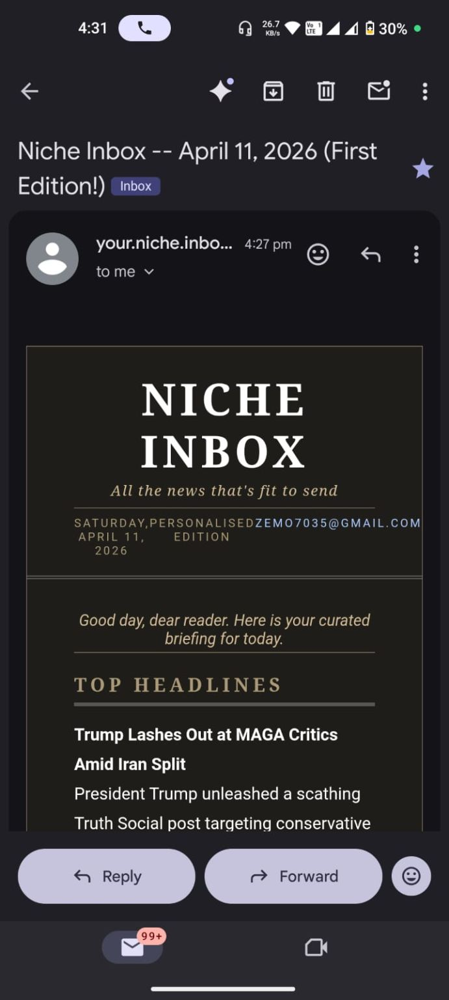

<div align="center">
  
  <h1>Niche Inbox</h1>
  <p><strong>A personalised daily news digest emailer.</strong></p>
</div>

<div align="center">
  
</div>

Add a friend's email to the source code, and they receive a one-time setup link to pick their topics and delivery time. From that moment on, they get a beautifully formatted newspaper-style digest every single day.

---

## 🚀 How It Works

1. **You add** a friend's email to `src/scripts/admin.py`
2. **App sends** them a stylish onboarding email with a unique setup link
3. **Friend opens** the link → fills an MCQ-style form (topics + delivery time)
4. **Immediately** after submitting — they receive today's digest right away
5. **Every day** at their chosen time — fresh digest lands in their inbox automatically

---

## 📂 File Structure

```
news-digest/
├── src/
│   ├── main.py              # Entry point — starts Flask + scheduler
│   ├── core/
│   │   ├── news_fetcher.py  # Fetches live news from NewsAPI
│   │   ├── summarizer.py    # Summarises articles via Mistral API
│   │   ├── email_sender.py  # Gmail OAuth2 sending
│   │   ├── scheduler.py     # APScheduler — per-user cron jobs
│   │   └── database.py      # SQLite — user preferences storage
│   ├── api/
│   │   └── preferences.py   # Flask routes (preference form + submission)
│   ├── scripts/
│   │   ├── admin.py         # Add/remove recipient emails here
│   │   ├── onboarding.py    # Sends setup emails to new users
│   │   ├── setup_auth.py    # Google OAuth token setup
│   │   ├── check_auth.py    # Verify OAuth tokens
│   │   ├── force_send.py    # Trigger digests manually
│   │   └── resend_mail.py   # Resend onboarding emails
│   └── templates/
│       ├── preferences.html # MCQ preference form (newspaper style)
│       └── success.html     # Confirmation page after submission
├── docs/
│   └── architecture.md      # Detailed system architecture & flow diagrams
├── digest.db                # SQLite database (generated automatically)
├── requirements.txt
├── .env.example
└── README.md
```

---

## ⚙️ Setup Instructions

### 1. Clone & Install

```bash
git clone <your-repo-url>
cd news-digest
python -m venv venv
source venv/bin/activate       # Windows: venv\Scripts\activate
pip install -r requirements.txt
```

### 2. Set Up Environment Variables

```bash
cp .env.example .env
```

Edit `.env` and fill in your API keys (see below for how to get each one).

### 3. Get Your API Keys

#### NewsAPI
1. Go to [https://newsapi.org](https://newsapi.org) and click **Get API Key**
2. Sign up for a free account
3. Copy your API key → paste into `NEWSAPI_KEY` in `.env`

#### Mistral API
1. Go to [https://console.mistral.ai](https://console.mistral.ai)
2. Sign up and navigate to **API Keys**
3. Create a new key → paste into `MISTRAL_API_KEY` in `.env`

#### Gmail OAuth2
1. Go to [https://console.cloud.google.com](https://console.cloud.google.com)
2. Create a new project (or select existing)
3. Go to **APIs & Services → Enable APIs** → enable **Gmail API**
4. Go to **APIs & Services → Credentials**
5. Click **Create Credentials → OAuth 2.0 Client ID**
6. Choose **Desktop App**, give it a name, click **Create**
7. Click **Download JSON** → rename the file to `credentials.json`
8. Place `credentials.json` in the project root directory
9. Set `GMAIL_ADDRESS` in `.env` to the Gmail account you used

> **First run:** A browser window will open asking you to log in to Google and grant permission. This only happens once. A `token.json` file is saved locally for all future sends.

### 4. Add Recipients

Open `src/scripts/admin.py` and add your friends' email addresses:

```python
RECIPIENTS = [
    "alice@example.com",
    "bob@example.com",
]
```

### 5. Run the App

```bash
python -m src.main
```

On startup the app will:
- Initialise the SQLite database
- Send onboarding emails to anyone new in `RECIPIENTS`
- Start the scheduler for all active users
- Start the Flask server at `http://localhost:5000`

---

## 👥 The Onboarding Flow (for your friends)

1. They receive an email from you titled **"You're Invited — Set Up Your Niche Inbox"**
2. They click the **Set Your Preferences** button
3. A newspaper-style form opens in their browser:
   - ☑ Checkboxes for 8 news topics
   - 🕐 Time picker for delivery time
   - 🌍 Timezone dropdown
4. They click **Confirm My Subscription**
5. They immediately receive today's digest
6. Every day at their chosen time — fresh digest arrives automatically

---

## ☁️ Deploying for 24/7 Running

### Railway (Recommended)

1. Push your code to a GitHub repository
2. Go to [https://railway.app](https://railway.app) and sign up
3. Click **New Project → Deploy from GitHub**
4. Select your repository
5. Add environment variables under **Variables** tab (same as your `.env`)
6. Upload `credentials.json` and `token.json` as environment file secrets or use Railway's volume storage
7. Set `BASE_URL` to your Railway-assigned URL (e.g. `https://your-app.railway.app`)
8. Deploy!

### Render

1. Push code to GitHub
2. Go to [https://render.com](https://render.com) and sign up
3. Click **New → Web Service** → connect your repo
4. Set **Start Command** to: `python -m src.main`
5. Add environment variables in the **Environment** tab
6. Deploy!

> ⚠️ For cloud deployment, you'll need to run `python -m src.main` locally first to generate `token.json`, then upload it to your server or use a secrets manager.

---

## 📑 Topics Available

| Topic | Coverage |
|-------|----------|
| Headlines | Top global news |
| Technology | Tech industry news |
| Politics | Political developments |
| Sports | Sports results and news |
| World Stocks | Financial markets |
| Science | Scientific discoveries |
| Entertainment | Movies, TV, culture |
| Job Openings | Employment news |

---

## 📝 Notes

- `credentials.json` and `token.json` are in `.gitignore` — never commit them
- The SQLite database (`digest.db`) is created automatically on first run
- Each user's setup link is one-time use and unique to them
- If you add a user who already exists in the database, no duplicate email is sent
