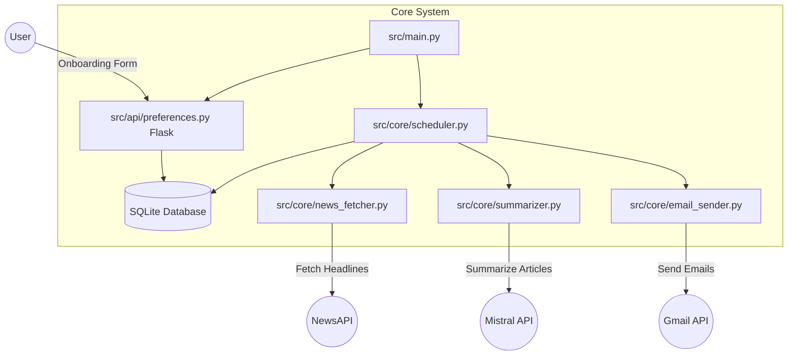
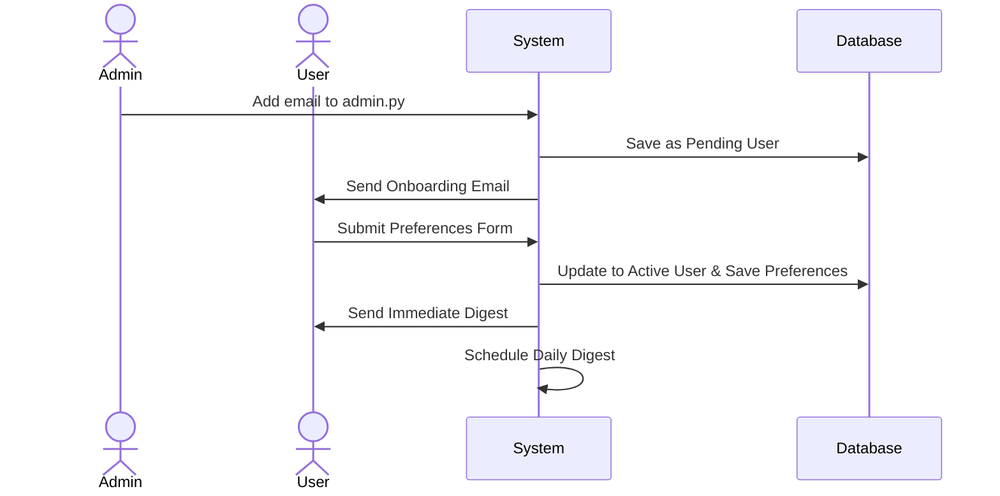
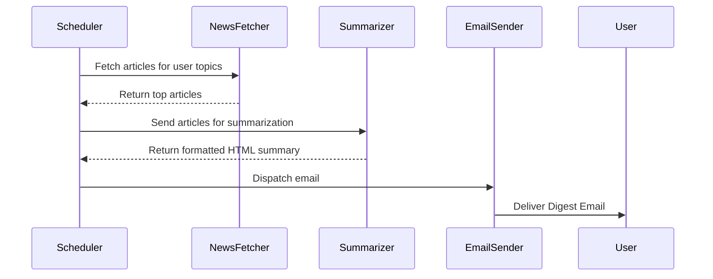

# System Architecture

## Overview
Niche Inbox is a Python-based daily news digest emailer that aggregates live news via NewsAPI, summarizes them using the Mistral AI API, and delivers beautifully formatted emails using Gmail OAuth2.

## High-Level Architecture

## Application Flow

### 1. Onboarding Flow
1. An admin adds a user's email to `src/scripts/admin.py`.
2. On startup, `src/scripts/onboarding.py` detects new users and sends an invitation email.
3. The user clicks the link, which opens the Flask web form `src/api/preferences.py`.
4. The user selects their preferred topics and delivery time.
5. The data is saved to `digest.db` and the user's daily scheduler is activated.

### 2. Daily Digest Flow
When the scheduled time arrives for a given user:

## Database Schema
The SQLite database `digest.db` contains a `users` table:
- `id` (INTEGER): Primary Key
- `email` (TEXT): User's email address
- `token` (TEXT): Unique onboarding token
- `topics` (TEXT): JSON array of selected topics
- `delivery_time` (TEXT): E.g., "08:00"
- `timezone` (TEXT): User's timezone (e.g., "America/New_York")
- `active` (INTEGER): 0 (pending) or 1 (active)
